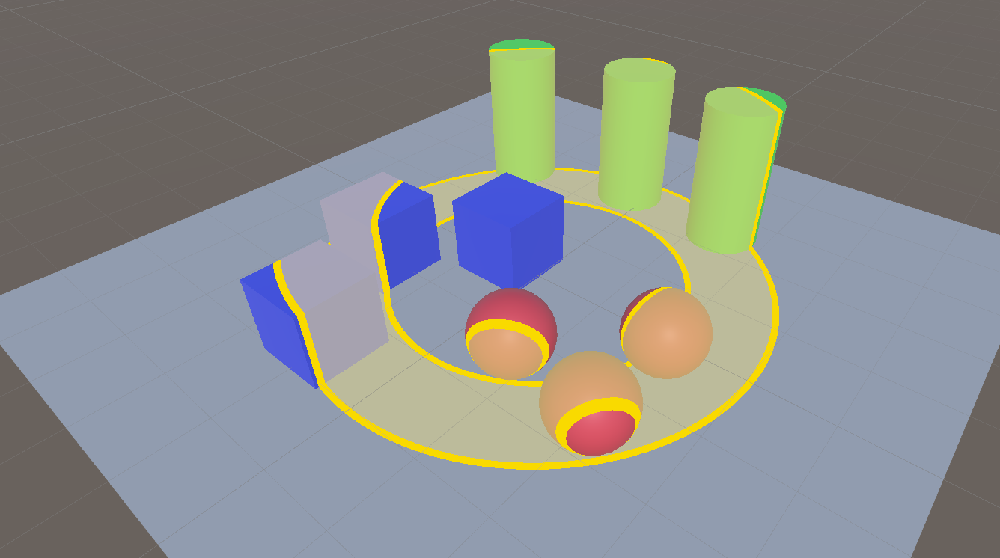
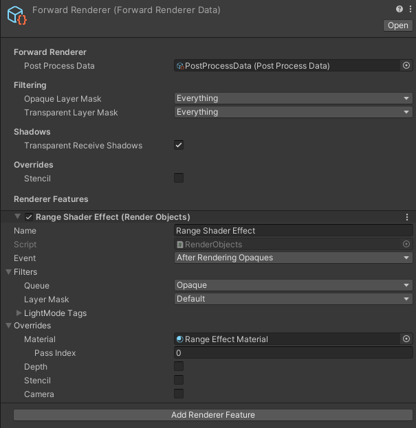
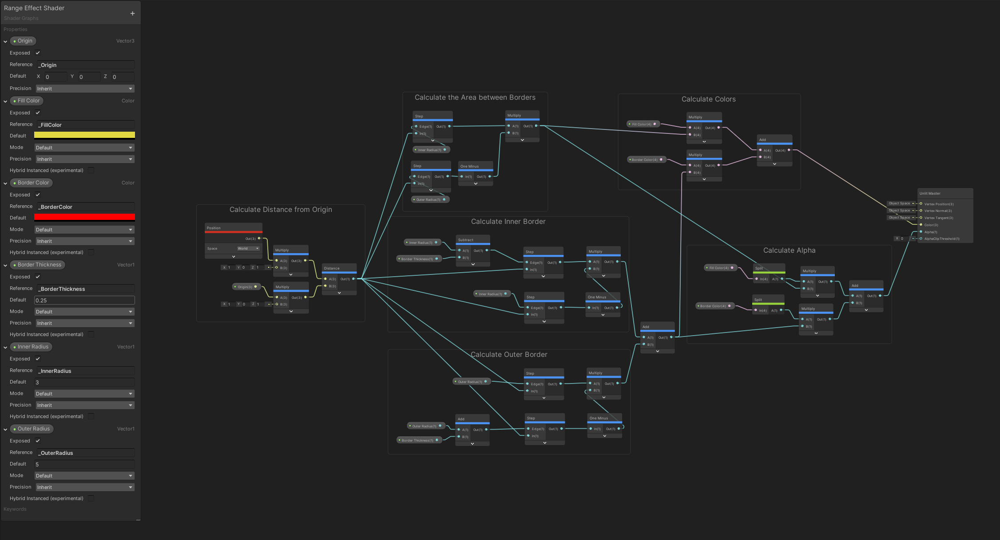

# Range Shader Example

A shader made in shadergraph that shows a configurable range.  
Note: The project uses Unity 2020.1.9f but the shader should work on older versions like 2019.

## How It Works

It uses the new "Render Objects (Experimental)" feature allowing you to use overrides at any point of the rendering process, in this case to use this material after all opaque objects.

## Shader Graph

